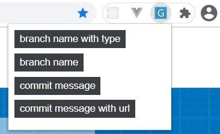

# zentao-gitflow-chrome-plugin



## example:

- branch name with type

```text
feature/add_type
```

- branch name

```text
add_type
```

- commit message

```text
  fix(project): common BUG #23013 增加branch_name_with_type
```

- commit message with url

```text
  fix(project): common BUG #23013 增加branch_name_with_type http://192.168.0.100:20000/index.php?m=bug&f=view&bugID=23013
```